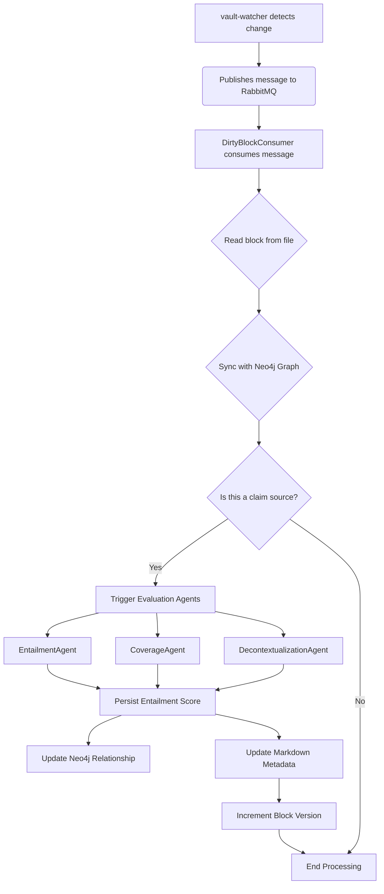

# Block Syncing Loop Implementation

This document describes the implementation of the reactive block synchronization loop, which processes dirty block notifications from the vault-watcher service.

## Overview

The block syncing loop is implemented in `services/aclarai-core/aclarai_core/dirty_block_consumer.py` as the `DirtyBlockConsumer` class. This service is a critical component of aclarai's real-time infrastructure. It:

1.  Consumes RabbitMQ messages from the `aclarai_dirty_blocks` queue.
2.  Processes individual dirty block notifications to synchronize content changes with the Neo4j graph.
3.  Implements optimistic locking via version checking to prevent data conflicts.
4.  **Orchestrates the evaluation agent pipeline** (`Entailment`, `Coverage`, `Decontextualization`) for new or modified claims.
5.  **Persists evaluation scores** to both the Neo4j graph and the source Markdown files.
6.  Marks updated nodes for further reprocessing by other system components.

## Architecture

### Message Flow

The reactive sync loop is triggered by messages from the `vault-watcher`. The `DirtyBlockConsumer` then orchestrates a multi-step process to ensure both the graph and the vault files are updated with the latest content and evaluation data.

### Version Checking Logic

The implementation follows the optimistic locking strategy from `docs/arch/on-graph_vault_synchronization.md`:

-   **If `vault_ver == graph_ver`**: Clean update, increment graph version.
-   **If `vault_ver > graph_ver`**: Proceed with update (vault is more recent).
-   **If `vault_ver < graph_ver`**: **Conflict detected** - skip update and log a warning.

### Version Incrementing

The version of a block (`ver=N` in the Markdown comment) is incremented each time its metadata is updated. This happens in two phases:

1.  The graph version is incremented when the block's content hash changes.
2.  The Markdown version is incremented by the `MarkdownUpdaterService` each time a new evaluation score is written to the file.

## Key Components

### DirtyBlockConsumer

The main class that handles:

-   RabbitMQ connection and message consumption.
-   Parsing block data from files.
-   Coordinating with the `BlockParser` and `Neo4jGraphManager`.
-   **Orchestrating the evaluation agents** to generate quality scores for claims.
-   **Persisting evaluation scores** by calling the `ClaimEvaluationGraphService` and `MarkdownUpdaterService`.

## Evaluation Workflow

When a message for a `created` or `modified` block is processed, the `DirtyBlockConsumer` initiates the evaluation workflow:

1.  **Claim Retrieval**: It queries the graph to find any claims that originate from the dirty block and need evaluation.
2.  **Agent Invocation**: For each claim, it invokes all three evaluation agents:
    -   `EntailmentAgent`
    -   `CoverageAgent`
    -   `DecontextualizationAgent`
3.  **Score Persistence**:
    -   **Graph**: The returned scores (or `null` on failure) are persisted to the `[:ORIGINATES_FROM]` relationship in Neo4j via the `ClaimEvaluationGraphService`.
    -   **Markdown**: Non-null scores are written as `<!-- aclarai:score_name=value -->` comments in the source Markdown file via the `MarkdownUpdaterService`, which handles atomic writes and version incrementing.

## Integration

### With vault-watcher

-   Consumes messages published by `DirtyBlockPublisher`.
-   Uses the same queue name: `aclarai_dirty_blocks`.
-   Handles the standard message format from the vault-watcher.

### With Neo4j Graph

-   Updates `:Block` nodes with new text and hash.
-   Increments version numbers properly.
-   Sets `needs_reprocessing: true` for downstream processing.
-   **Updates `[:ORIGINATES_FROM]` relationships with evaluation scores.**

### With Evaluation Agents

-   Acts as the primary orchestrator for the `EntailmentAgent`, `CoverageAgent`, and `DecontextualizationAgent`.
-   Provides the necessary inputs (claim text, source text) to the agents.
-   Handles the outputs (scores, omitted elements) for persistence.

## Differences from Periodic Sync

| Aspect                  | Reactive Sync Loop                               | Periodic Vault Sync                |
| ----------------------- | ------------------------------------------------ | ---------------------------------- |
| **Trigger**             | RabbitMQ messages (real-time)                    | Scheduled cron job                 |
| **Scope**               | Individual blocks                                | All vault files                    |
| **Primary Function**    | Sync content **and trigger evaluations**         | Sync content only                  |
| **Performance**         | Real-time updates for single changes             | Batch processing for full-vault sync |
| **Error Handling**      | Message requeue                                  | Job retry                          |