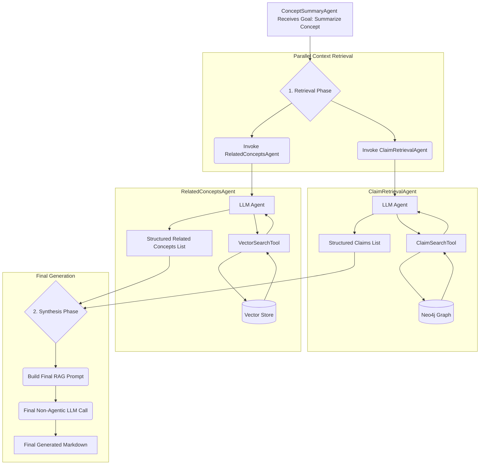

# Concept Summary Agent

## Overview

The Concept Summary Agent generates detailed Markdown pages for each canonical concept in the Neo4j knowledge graph. It follows the specifications from `docs/arch/on-writing_vault_documents.md` and uses the RAG (Retrieval-Augmented Generation) workflow described in `docs/arch/on-RAG_workflow.md`.

## Purpose

The agent creates `[[Concept]]` pages that serve as definitive reference documents for concepts identified and promoted through the aclarai pipeline. Each page provides:

- A clear definition of the concept
- Relevant examples from claims and summaries with `^aclarai:id` references
- Links to related concepts for navigation
- Consistent formatting following the established patterns

## Architecture

The `ConceptSummaryAgent` now acts as a top-level orchestrator, delegating specific data retrieval tasks to specialized, single-purpose LlamaIndex sub-agents. This refactoring allows for a more modular and extensible architecture, leveraging LlamaIndex's agentic capabilities for focused retrieval while maintaining procedural control over the final content generation.



### Input Sources

The agent delegates information retrieval to specialized sub-agents, each utilizing specific tools to interact with the underlying data sources:

| Source | Sub-Agent | Tool Used | Data Source | Purpose |
|--------|-----------|-----------|-------------|---------|
| **Claims** | `ClaimRetrievalAgent` | `ClaimSearchTool` | Neo4j Graph | Retrieve direct supporting evidence (claims) linked to the concept. |
| **Related Concepts** | `RelatedConceptsAgent` | `VectorSearchTool` | Vector Store | Find semantically similar concepts based on vector embeddings. |
| **Summaries** | (Direct Query) | (N/A) | Neo4j Graph | Retrieve contextual summaries related to the concept. (Currently a direct query, future work may integrate an agent) |
| **Utterances** | (Direct Query) | (N/A) | Vector Store | Find natural language usage examples related to the concept. (Currently a direct query, future work may integrate an agent) |

### Output Format

Generated files follow the exact format specified in `docs/arch/on-writing_vault_documents.md`:

```markdown
## Concept: <concept name>

<definition paragraph>

### Examples
- <claim or utterance> ^aclarai:id
- ...

### See Also
- [[Related Concept A]]
- [[Related Concept B]]

<!-- aclarai:id=concept_<slug> ver=N -->
^concept_<slug>
```

## Configuration

The agent is configured through the `concept_summaries` section of the aclarai configuration:

```yaml
concept_summaries:
  model: "gpt-4"              # LLM model for content generation
  max_examples: 5             # Maximum examples to include
  skip_if_no_claims: true     # Skip concepts with no supporting claims
  include_see_also: true      # Include "See Also" section
```

## Key Features

### Atomic File Writing

All file operations use the safe atomic pattern:
1. Write to temporary file (`.tmp` extension)
2. Force sync to disk (`fsync`)
3. Atomic rename to final location

This prevents corruption and ensures vault watchers see complete files.

### Quality Filtering

- Respects the `skip_if_no_claims` setting to avoid generating empty concept pages
- Prioritizes claims by relationship strength when selecting examples
- Orders content by relevance and recency

### Error Resilience

- Continues processing other concepts if individual concepts fail
- Provides detailed error reporting and statistics
- Uses retry logic for transient Neo4j connection issues

## Usage

### Via Python API

```python
from aclarai_shared.concept_summary_agent import ConceptSummaryAgent
from aclarai_shared.config import load_config

# Load configuration
config = load_config()

# Create and run agent
agent = ConceptSummaryAgent(config=config)
result = agent.run_agent()

print(f"Generated {result['concepts_generated']} concept pages")
```

### Via CLI

```bash
# Run with default configuration
python run_concept_summary_agent.py

# Run with custom config
python run_concept_summary_agent.py --config /path/to/config.yaml

# Dry run to see what would be generated
python run_concept_summary_agent.py --dry-run

# Enable debug logging
python run_concept_summary_agent.py --log-level DEBUG
```

### Via Scheduler

The agent can be integrated into the scheduler service by adding a job configuration:

```yaml
scheduler:
  jobs:
    concept_summary_generation:
      enabled: true
      manual_only: false
      cron: "0 4 * * *"  # Run daily at 4 AM
      description: "Generate concept summary pages"
```

## Implementation Notes

### Implementation Details

1. **Orchestration vs. Generation**: The agent's architecture deliberately separates data retrieval from final content generation. Retrieval is handled by agentic sub-systems that can intelligently use tools. The final step—synthesizing the retrieved context into a Markdown page—is a non-agentic, direct LLM call. This provides deterministic control over the final output format while allowing flexibility in data gathering.

2. **Agentic Summaries and Utterances**: Currently, the retrieval of summaries and utterances is still handled by direct queries within the `ConceptSummaryAgent`. Future enhancements will integrate dedicated sub-agents for these tasks, similar to claims and related concepts.

3. **Incremental Updates**: Currently regenerates all concept pages. Future versions could implement change detection to only update modified concepts.

### Future Enhancements

1. **Full LLM Content Generation**: Implement comprehensive LLM-generated definitions and descriptions, moving beyond template-based content.
2. **Agentic Summaries and Utterances**: Introduce `SummaryRetrievalAgent` and `UtteranceRetrievalAgent` to fully delegate these retrieval tasks.
3. **Content Quality Assessment**: Add quality metrics and validation for generated content.
4. **Incremental Processing**: Track concept modifications and only regenerate changed concepts.

## File Locations

- **Main Agent**: `shared/aclarai_shared/concept_summary_agent/agent.py`
- **Sub-Agents**: `shared/aclarai_shared/concept_summary_agent/sub_agents/`
- **Configuration**: `shared/aclarai_shared/aclarai.config.default.yaml`
- **Tests**: `tests/test_concept_summary_agent.py`
- **CLI Entry Point**: `run_concept_summary_agent.py`
- **Generated Files**: `{vault_path}/{tier3_path}/*.md`

## Dependencies

- **Neo4j**: For graph queries and concept retrieval
- **aclarai Configuration System**: For settings and parameters
- **LlamaIndex**: For agent orchestration and tool utilization
- **Python Standard Library**: For file operations and utilities

The agent is designed to work with minimal dependencies and gracefully handle missing optional components (like vector stores or LLM providers).

## Testing

The agent includes comprehensive tests covering:

- Initialization and configuration loading
- Content generation with various inputs
- File writing and atomic operations
- Error handling and edge cases
- Integration workflows

Run tests with:
```bash
python tests/test_concept_summary_agent.py
```